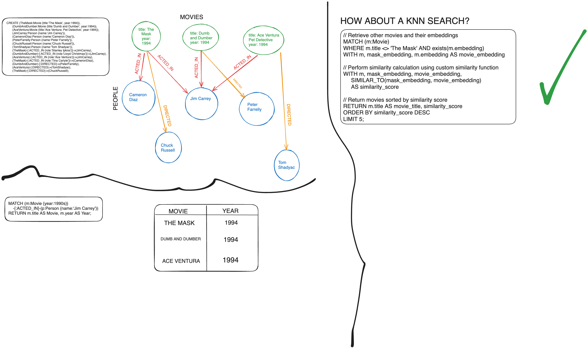
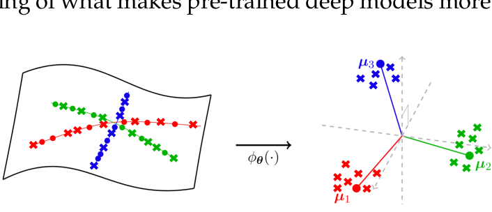

<!-- 
✅ - complete
⏰ - in progress
❌ - struggle / cannot complete
-->

# Winter 2023 Research Log

<!-- TABLE OF CONTENTS -->
<details open="open">
  <summary>Table of Contents</summary>
  <ol>
    <li>
      <a href="#weekly-updates">Weekly Updates</a>
      <ol>
        <li><a href="#week-one">Week One</a></li>
        <li><a href="#week-two">Week Two</a></li>
        <li><a href="#week-three">Week Three</a></li>
        <li><a href="#week-four">Week Four</a></li>
        <li><a href="#week-five">Week Five</a></li>
        <li><a href="#week-six">Week Six</a></li>
        <li><a href="#week-seven">Week Seven</a></li>
        <li><a href="#week-eight">Week Eight</a></li>
      </ol>
    </li>
    <li><a href="#key-findings">Key Findings</a></li>
    <li><a href="#possible-solutions">Possible Solutions</a></li>
    <li><a href="#glossary">Glossary</a></li>
    <li><a href="#overall-questions">Overall Questions</a></li>
  </ol>
</details>

**Key:**
✅ - complete | ⏰ - in progress | ❌ - struggle / cannot complete
<!-- Weekly Updates -->
## Weekly Updates
### Week One

###### *Dates:* January 8-14, 2024

###### *Main Objective:* Begin to understand ArangoDB and OpenCypher codebase

#### Team Tasks:
1. ✅ Reorganize GitHub
2. ✅ Fork [OpenCypher](https://github.com/opencypher/openCypher) and [ArangoDB](https://github.com/arangodb/arangodb).
3. ❌ Setup Dockerfile so ArangoDB and OpenCypher will work on all machines. 
    - Too many setup operations...Dockerfile would be unrealistic and a waste of time.
4. ⏰ Setup ArangoDB and OpenCypher in CSC, create straightforward instructions for rest of team.
5. Beginning looking into documentation for both [OpenCypher](https://s3.amazonaws.com/artifacts.opencypher.org/openCypher9.pdf) and [ArangoDB](https://docs.arangodb.com/3.11/aql/). 
6. ✅ Find CFG implementations in both codebases. 
7. ⏰ Begin to understand how the CFG works in parallel with the rest of the codebase.
8. ✅ Reach out to the teams of both and ask if they have the feature we are looking for. 
8. ✅ Update pushing functionality for both repos.

#### Individual Tasks:
1. ✅ Wyatt - research and understand CFGs

#### Accomplishments:
- January 10th: 
  - Will:
    - rearranged GitHub to be more friendly towards the year's project. Added space for research logs and key findings, glossary, etc.
- January 12th: 
  - Will:
    - forked codebases for both ArangoDB and OpenCypher, [arangodb_esrp](https://github.com/wrcorcoran/arangodb_ersp) and [opencypher](https://github.com/wrcorcoran/openCypher_ersp).
    - updated README.md for both and added collaborators along with proper permissions.
    - located directory for grammars in both codebases.
- January 13th:
  - Will:
    - located ```grammar_tools```, which the Grammar specifications by openCypher. 
    - Tried to run both ArangoDB and OpenCypher's GitHubs and ran into errors for both. See ```Struggles``` for more information.
    - Working on following the ArangoDB specifications for [contributing](https://github.com/arangodb/arangodb/blob/devel/CONTRIBUTING.md#building).
  - Niyati:
    - Niyati sent messages to both teams to ask if they are working on a similar functionality to what we could "use."Is there a function on both these    platforms to query the graph and the latent space?

#### Specific Questions:
- What is Gherkin? Encountered it while looking into the OpenCypher codebase.
- How are we supposed to use ArangoDB if we have to pay? Also, there seems to be no option to use it strictly in terminal, so do we have to craft that ourself? **(Ignore. Answered by more reading.)**

#### Relevant Papers / Links:
- [ArangoDB Github](https://github.com/arangodb/arangodb)
- [ArangoDB documentation](https://docs.arangodb.com/3.11/aql/)
- [OpenCypher Github](https://github.com/opencypher/openCypher)
- [OpenCypher documentation](https://s3.amazonaws.com/artifacts.opencypher.org/openCypher9.pdf)
- [Context free schemas for data-XML (important for OpenCypher)](https://www.w3.org/People/Bos/Schema/schemas)
- [Indicated as Syntax Tree Template by OpenCypher](https://www.w3.org/2001/XMLSchema)
- [Cypher Railroad Diagram of Grammar](https://s3.amazonaws.com/artifacts.opencypher.org/M23/railroad/Cypher.html)
- [Cypher Specific Style Guide](https://s3.amazonaws.com/artifacts.opencypher.org/M23/docs/style-guide.pdf)
- [ArangoDB Contributing Guide (includes building specifications)](https://github.com/arangodb/arangodb/blob/devel/CONTRIBUTING.md#building)

#### Notes:
- ArangoDB grammar is found in 'arangod/Aql/grammar.cpp' and 'arangodb/Aql/grammar.hpp' and 'Aql/grammar.y'. Have not identifying the exact files (and what they do), but that will be the next step.
- OpenCypher's grammar is found under 'grammar' (wow!). Includes a README.md with specifics about the grammar.

#### Struggles:
- Running into Maven build errors when trying to execute the ```mvn -U clean install -P scala-213 -Dlicense.skip``` command. Unsure if this is because of something I don't have installed correctly or a dependency failure further up.
  - The specific error is ```org.apache.maven.plugins:maven-compiler-plugin:3.8.1:compile (default-compile) on project grammar: Fatal error compiling: invalid target release: 11 -> [Help 1]```. I've ran it in debug mode and get messages that are relatively unreadable. Not sure where to go here.

### Week Two

###### *Dates:* January 15-21, 2024

###### *Main Objective:* Understand CFGs and play around in terminal

#### Team Tasks:
1. ⏰ Setup ArangoDB and OpenCypher in CSC, create straightforward instructions for rest of team.
2. ⏰ Beginning looking into documentation for both [OpenCypher](https://s3.amazonaws.com/artifacts.opencypher.org/openCypher9.pdf) and [ArangoDB](https://docs.arangodb.com/3.11/aql/), understand the language to build off of.  
3. ⏰ Begin to understand how the CFG works in parallel with the rest of the codebase.

#### In Progess:
- Figuring out how to run both ArangoDB and OpenCypher. Building documentation. 

#### Accomplishments:
- January 15th:
  - Will:
    - decided that the requirements to set up a Dockerfile for each would be too much, as they both require a large amount of steps. 
    - decided to move to CSIL, with doing this, create documentation to set up and install. 
- January 16th: 
  - got verified for CSC, able to clone both directories. Currently, working on initializing and running both. 
- January 17th:
  - Will:
    - looked into two different sites (listed below) recommended by Danish, regarding FAISS's usage with ArangoDB. Neither of them appear to be what we are doing, rather, they are just functionality to run after querying.
  - Niyati:
    - got in contact with Arango, they listed out a few ways to implement the functions:
    1. Vector Similarity Functions
    2. Full-Text Search with Semantic Features
    3. Graph Traversal and Algorithms
    4. User-Defined Functions (UDFs): Custom UDFs, External libraries, ArangoML
- Janauary 19th:
  - Will:
    - Beginning to setup ArangoDB and OpenCypher to run in terminal on CSC. 
      - Currently running into problems running FISH (ArangoDB)
      - Cannot use ```yum```, but ArangoDB requires a fish shell to run. 
      - Trying to find workarounds (installing Miniconda, then installing fish)
      - Turns out those don't help too much, instead, have to make a singularity container. This requires me to install VirtualBox on my local, which I have. However, running into hiccups and will resume tomorrow, the 20th. Nvm, can use singularity straight in knot, but still weird. Need to figure it out.
- January 21st:
  - Will:
    - Still struggling to get ArangoDB or OpenCypher to work, really frustrating actually. Difficult to get it working on CSC due to all of the permissions limitations (not allowed to sudo or anything).
    - Working on my local machine (ArangoDB), not sure how to run tests and play around yet
    - Currently, trying to find a way to get this to work on the CSC machine
      - tried all sorts of things (docker images converted to singularity images, docker pull options, etc.)
    - Everytime, run into errors on CSC machines because of sudo'ing or superuser. 
      - Due to lack of permissions, I think this is likely unpossible, leaving us with a Dockerfile.
    - Trying the built-in Dockerfile (local) for ArangoDB's Oskar. 
      - This would allow us to work locally and in the same environment. Seems promising if they can install.
      - Running into problems with fish and locating files. Testing that out. 
    - However, ArangoDB is making progress locally... runs openSSL command for about 10 minutes upon installation... will report what happens after. 
      - openSSL was fine - then get incompatible compiler errors
    - If do not get successful build tonight, will drop ArangoDB and focus solely on getting openCypher to work.
      - Most recent Docker build - 30 minutes. Will focus strictly on openCypher after this.
      - This is how terminal appears:
      

    - OpenCypher error (installing any package on a ubuntu singularity shell in CSC):
  


#### Specific Questions:
- 

#### Relevant Papers / Links:
- [ArangoDB documentation](https://docs.arangodb.com/3.11/aql/)
- [OpenCypher documentation](https://s3.amazonaws.com/artifacts.opencypher.org/openCypher9.pdf)
- [Context free schemas for data-XML (important for OpenCypher)](https://www.w3.org/People/Bos/Schema/schemas)
- [Indicated as Syntax Tree Template by OpenCypher](https://www.w3.org/2001/XMLSchema)
- [Cypher Railroad Diagram of Grammar](https://s3.amazonaws.com/artifacts.opencypher.org/M23/railroad/Cypher.html)
- [Cypher Specific Style Guide](https://s3.amazonaws.com/artifacts.opencypher.org/M23/docs/style-guide.pdf)
- [ArangoDB Contributing Guide (includes building specifications)](https://github.com/arangodb/arangodb/blob/devel/CONTRIBUTING.md#building)
- [ArangoDB Interactive Tutorials](https://github.com/arangodb/interactive_tutorials/blob/master/README.md)
- [fastgraphml](https://github.com/arangoml/fastgraphml/tree/main)

#### Notes:
- ArangoDB Interactive Tutorials - FAISS implementation is fragmented and unfinished. However, It appeared that they were using FAISS on top. Not as a querying capability. This is not what we are looking for. 
- fastgraphml - This basically just involves the power of FAISS into fastgraphml. There is no difference between using FAISS's function and fastgraphml's. fastgraphml purely implements FAISS's functionality, which no added usage. However, it does add the capability to *store* embeddings back into FAISS. The implementation is to include the nearest neighbors and their respective cosine similarity as a list in the database. This could be helpful with ideas for how to store it - but not as a querying functionality.

- Zero progress being made on installing ArangoDB. Thinking it's probably wise to give that up. Moving to focus strictly on OpenCypher. If that doesn't work, will have to move to a smaller repository to build on top of. 

### Week Three

###### *Dates:* January 22-28, 2024

###### *Main Objective:* Understand CFGs and play around in terminal

#### Team Tasks:
1. ✅ Setup ArangoDB and OpenCypher in CSC (possibly just OpenCypher), create straightforward instructions for rest of team.
2. ⏰ Beginning looking into documentation for [OpenCypher](https://s3.amazonaws.com/artifacts.opencypher.org/openCypher9.pdf) understand the language to build off of.  
3. ⏰ Begin to understand how the CFG works in parallel with the rest of the codebase.
4. ⏰ Locate a way we can insert FAISS into OpenCypher (if possible).
5. Develop a test suite for OpenCypher. 
6. Look into GraphQL. Can this help us?

#### Task Breakdown:
niyati:
- look into and understand graphql
- look into smaller query languages

will:
- ⏰ find a place to input faiss into the language
- ⏰ look into the graphql setup (or other graphdb we choose)

wyatt:
- create a comprehensive list / explanation of open cypher’s grammar implementation

#### In Progess:


#### Accomplishments:
- January 22:
  - Will:
    - Got ArangoDB to build Dockerfile (however, couldn't recognize ssh-agent and Docker)
    - Have decided to pause any work with ArangoDB. OpenCypher is more straightforward to operate. 
    - Currently, going to focus on OpenCypher.
      - Making great progress - farthest ever gotten on a build.
      - Had to reset JAVA_HOME variable, tough with Dockerfile, eventually got it.
      - Running deeper into test set for ```mvn``` project.
      - BUILD SUCCESS! Bingo!
    - Noted, TCK is their test suite. They used Cucumber files (.feature) to assist with tests.
    - Have set up Ubuntu-based Dockerfile for OpenCypher.
    - Updated documentation for OpenCypher usage.
- January 28:
  - Will:
    - Looking into Cypher implementation. Looking for ways we can run a query.
    - Definitely doable in OpenCypher. The querying and commands link to a function in a Java Program. We can use these programs to implement.
    - **Notes**:
      - Basic pieces (terminals, non-terminals, xml classes, types, all defined in ```ocGrammar.xsd```)
      - More specific usages (and exact parsing) implemented in various files (```basic-grammar.xml, cypher.xml, pre-parser.xml```)
      - The actual implementation is handle in ```tools/grammar/src/main```. There are various files here that do the behind the scenes DB work (and the parsing). They store all information as parse trees (or so it seems, didn't focus too much on it.)
      - Would make sense to use the ```WITH``` command. ```WITH``` basically appends/combines/changes results with a subquery before moving to the next line.
    - Here is an example of an OpenCypher query:
    
    - **How could we do this (i.e. what is the implementation)**:
      - Add XML lines to the ```grammar.xml``` file
      ```XML
      <production name="Nearest" scope:rule="new">
        Nearest
        <non-terminal ref="ProjectionBody"/>
        <opt>&WS;<non-terminal ref="Where"/></opt>
      </production>
      ```

#### Specific Questions:
- 

#### Relevant Papers / Links:
- [OpenCypher documentation](https://s3.amazonaws.com/artifacts.opencypher.org/openCypher9.pdf)
- [Context free schemas for data-XML (important for OpenCypher)](https://www.w3.org/People/Bos/Schema/schemas)
- [Indicated as Syntax Tree Template by OpenCypher](https://www.w3.org/2001/XMLSchema)
- [Cypher Railroad Diagram of Grammar](https://s3.amazonaws.com/artifacts.opencypher.org/M23/railroad/Cypher.html)
- [Cypher Specific Style Guide](https://s3.amazonaws.com/artifacts.opencypher.org/M23/docs/style-guide.pdf)

#### Notes:
- We have decided to hault all work on ArangoDB.
- Questions from Thomas: What does the output look like? What does the query language look like? Do we have to fun the intersections could we just, how    much of the Backend do we really really need to implement?
  - A: output: big dictionary Arango Query: where it connect key and pairs and keeps track of the KNN but this is all for Arango specifically
  - A: This should be modular because the ArangoDB will take in the graph and output the nodes that we want to then use those as an input for our FAISS function which will then have the nodes as the input and will output the information needed on those nodes
- GraphQL: This is something we can use instead of openCypher → this makes it easier to create your own grammar. We can use this instead of open cypher. We should find a simpler query language that can help make this a foundation for our own query language.
- Give openCypher another week but if this doesn’t work use GraphQL to get this project moving faster.
- Task: Go through the documentation of ArangoDB or OpenCipher to figure out where to input FAISS search in our Query language. (look at the slides in the final presentation), Expecting a walk through next meeting. Where we implement the FAISS search and how it effects the outcomes.
  - Find a simpler Graph Databases to understand how the grammar works, this will help us create a foundational grammar but also help us understand cypher better.

#### Struggles:
- 

### Week Four

###### *Dates:* January 29-February 4, 2024

###### *Main Objective:* Determine how we can implement in OpenCypher. Do we need to change to GraphQL?

#### Team Tasks:
1. ❌ Beginning looking into documentation for [OpenCypher](https://s3.amazonaws.com/artifacts.opencypher.org/openCypher9.pdf) understand the language to build off of.  
2. ❌ Begin to understand how the CFG works in parallel with the rest of the codebase.
3. ❌ Locate a way we can insert FAISS into OpenCypher (if possible).
4. ❌ Look into GraphQL. Can this help us?
---
After pivot:

5. ⏰ Begin to play around with datasets.
6. Understand the meaning of "centrality" and "homophily" with relation to graphs.
7. Begin to think about the MESP problem.
8. Begin to think about the NC problem.
9. Verify that we no longer want to work with the QL problem.
#### Task Breakdown:
niyati:
- look into and understand graphql
- look into smaller query languages

will:
- ❌ find a place to input faiss into the language
- ❌ look into the graphql setup (or other graphdb we choose)

wyatt:
- create a comprehensive list / explanation of open cypher’s grammar implementation

#### In Progess:


#### Accomplishments:
- January 29:
  - Will:
    - **What do the OpenCypher files do?**
      - ```ocGrammar.xml```
        - grammar, production, sequence, non-terminal, character, etc...
        - basic definition for the XML usage
      - ```cypher.xml```
        - query types: single, multiple, etc.
        - "statements" focusing on insertion and deletion
          - also indexing and relations
        - clauses: handling most operations (see documentation for full list and use case)
      - ```basic-grammar.xml```
        - vocabulary, true/false, operations like $+$, $-$, $\times$, $\div$, etc. 
    - **How is OpenCypher implemented?**
      - Complex, but it is an ANTLR G4 grammar.
      - Many, many JAVA files, but I think many of them are parsing and we can ignore. 
      - A better question is how are the operations implemented?
        - This is left relatively unanswered by the files. It feels somewhat incomplete.
    - **How could we do this (i.e. what is the implementation)**:
      - Add XML lines to the ```grammar.xml``` file
      ```XML
      <production name="Nearest" scope:rule="new">
        Nearest
        <non-terminal ref="ProjectionBody"/>
        <opt>&WS;<non-terminal ref="Where"/></opt>
      </production>
      ```
    - **What would the query look like?**
      ```
      WITH m, mask_embedding, movie_embedding,
          SIMILAR_TO(mask_embedding, movie_embedding)
          AS similarity_score
      ORDER BY similarity_score DESC LIMIT 5
      ```
   - **What is GraphQL?**
     - A way to manage querying across APIs. Not specifically used for graph data.
     - However, there are *mutations.* These can work to specific exactly what data we want.
     - However, we can query EXACTLY what we want. This could be very helpful as it functions mroe like a query language.
   - **How would we use GraphQL?**
     - I'm not really sure. This seems to be something used specifically for APIs, so if we were going to do that, it would make *more* sense to implement powerful UDFs.
   - **EdgeDB** is interesting.
     - Relational database...what if you insert relations to embeddings and give them a weighted relation (somehow, possible a precomupted FAISS)...
       - This could be done as a UDF?...
       - Example UDF in EdgeDB:
      ``` EdgeDB
      create function pig_latin(val: str) -> str
        using (
          select val[1:] ++ val[0] ++ 'ay'
        );
      ```
      - Problem here is you would have compute on the fly...but that's fine...more efficient likely
  
### **PIVOT**
---
- February 1st:
  - (Will) So, it seems that we are unlikely to find a solution for the querying problem. There is too much overhead required (meaning we need access to large DB platforms). However, we could implement the functionality, but we are unsure if it is worth it. Danish and Professor Singh have proposed the idea of us switching. There are two different project options.
    1. **Minimum edge set perturbations**:
      - *What is this?:* What is the set of all *combinations* of edges which can be added and have no effect on the original classification. Rather than the common adversarial product of "what is the minimum cost of edges we can add to change the classificaton?", we are targeting "what is the maximum cost of edges we can add to not change the classification?" Ideally, we would investigate certain characteristics of a graph (degree, homophily)    
    2. **Neural collapse**: 
      - *What is this?:* This is a common phenomenon in machine learning models. Once a model has been overfit, classifications begin to cluster. Here is an example:
  
      - This can lead to serious problems with model accuracy, as it is no longer able to generalize.
      - We want to know if this is a phenomenon that occurs in Graph Neural Networks. Whether it is or isn't is yet to be studied.
 - (Will) Created new repository for the MESP problem, see it [here](https://github.com/wrcorcoran/minimum-edge-set-perturbation). 
   - Started to play around with the dataset and building a model.
 - February 2nd:
   - (Will): For checks-and-bounds here are definitions:
     - **Degree:** the total number of edges containing a specific node. In a directed graph, in degree is the number of entering edges and out degree is the number of exiting edges.
     - **Centrality:** There are slightly different definitions based on the use, however, centrality indicates the most influential nodes (those with the highest centrality) or least influential nodes (those with lowest centrality). Different centrality types include: degree, closeness, eigenvalue, etc.
       - *Closeness centrality:* average length of shortest path between specific node and all other nodes in the graph.
     - **Homophily:** The idea that similar nodes will share edges and lie closer in a topological space. Likewise, any additional nodes added are likely to attach to similar nodes.
 

#### Specific Questions:
- What about pivoting and focusing on implementing a functionality? Why can we *not* do this?
  - What if instead of implementing as a query, we just implement an abstraction on top? Interface that works with a query under the hood?
  - What about building advanced UDFs? It seems our struggle isn't in building the functionality, it seems to be regarding the *query* implementation.
- **Idea:** Kind of far out there..., but what if we developed a layer which took a query. In this query, it contains a portion which is Cypher and a part which pertains to our FAISS functionality. We'd have to strictly write a functionality and language definition. However, instead of editing the codebase of Cypher, we could gather the portion of the query which is supposed to be dedicated to Cypher, and take the rest for our query... a little ways out there...

#### Relevant Papers / Links:
- [A Neural Collapse Perspective on Feature Evolution in Graph Neural Networks](https://arxiv.org/pdf/2307.01951.pdf)
  - [Code to said paper](https://github.com/kvignesh1420/gnn_collapse) 
- [Centrality](https://en.wikipedia.org/wiki/Centrality)
- [Homophily](https://en.wikipedia.org/wiki/Network_homophily)
- [IS HOMOPHILY A NECESSITY FOR GRAPH NEURAL NETWORKS?](https://arxiv.org/pdf/2106.06134.pdf)
- [How to train a model on the CORA dataset?](https://medium.com/mlearning-ai/ultimate-guide-to-graph-neural-networks-1-cora-dataset-37338c04fe6f)

#### Notes:
- (Will) I think considering GraphQL might be a good idea. OpenCypher feels incomplete. This leads me to believe that much of the implementation (and exactly what we want to do) is done on the Neo4J side (and behind the scenes). What is publicly available of OpenCypher seems to purely be a specification and Parser with no operations. 
  - Because of this, building on top of GraphQL might be a better idea. This can give us a way to implement the funtionality, because as far as I can tell, we are missing half of a codebase for Cypher. 
  - It's a shame that ArangoDB is such a cluster, because I think their entire codebase is public, and we'd be able to edit right on top of it. However, OpenCypher is purely just specification.
  - Nonetheless, I still outlined what *could* be an example of a query.
- (Will) EdgeDB is also another plausible idea. Relational database with high quality UDFs. Could package the UDFs in an interface (or some built-on-top functionality [maybe a ```.whl```]). This could be more beneficial than working in a very modern codebase (as EdgeDB is...) and certainly better than working in a legacy codebase like OpenCypher. 
- (Will) **My gut feeling** is we are going to want to pivot to UDFs and packaging them into functionality, rather than designing a literal query language. 

- (Wyatt) **FROM DANISH MEETING**:
  - Minimum edge bet bf perturbation
    - Some graph edges are much more important
    - Budget: how many changes you can afford to make on the graph
    - So minimize budget and maximize the change on the graph
    - How many changes can i afford to make without messing up the graph?
    - Lipschitz constant??? Can i bound my output change by a linear value of my input change
    - Come up with a heuristic that can map all the sets of edges that make the same output label based on the same input
    - Fixed ML gives certain output

    - Goal of our project:
      - Identify a set of edges which can be added and not modify the embeddings set by the model (i.e. which edges are safe).
      - Focus on three initial traits:
        - Degree (low degree vs high degree?)
        - Centrality
        - Homophily
  - Neural Collapse
    - Occurs due to overtraining and leaves no room for unseen data. Leave confidence at 80-95%

    - Goal of our project:
      - Does neural collapse happen in Graphs?
      - When GNNs overfit graph data can it lead to neural collapse? 

#### Struggles:

### Week Five

###### *Dates:* February 5-February 11, 2024

###### *Main Objective:* Begin to consider the MESP problem with three main heuristics. 

#### Team Tasks:
1. Will: Look into the *homophily* heuristic.
2. Niyati: Look into the *degree* heuristic.
3. Wyatt: Look into the *nearest-neighbors* heuristic.

#### In Progess:


#### Accomplishments:
- February 5th:
  - Discussed our thoughts on the problems.
  - The team seemed to most strongly favor the *Minimum Edge Set Perturbation* problem. It seemed we generally were more comfortable with this problem. As the team has more graph experience, this seemed to be more fit.
- February 7th:
  - Talked to Danish, told him we were leaning towards the MESP problem.
  - He gave us a clearer definition of the heuristics and gave us some ideas for how to set up the model and play around. He gave us a clearer definition of the ground truth.
  - He recommended we use the PODs for many of our tasks.
  - The team installed Conda and is setting up a time to talk to him about using notebooks on the pods.
- February 9th:
  - Met with Thomas, discussed our progress.
    - He gave us some thoughts about how the use of adversarial attack analysis was for robustness rather than a real scenario (often, although, it can happen).
  - Continued to talk with the team about getting everything set up.
- February 11th:
  - Will:
    - Uploaded template notebooks for the team to use:
      - Folders for ```embeddings```, ```experiments```, and the ```model```.
    - Began looking into how adding homophilic edges can effect the overall results compared to the ground truth of the model.
    - A few interesting things (for more in depth, please go [here](https://github.com/wrcorcoran/minimum-edge-set-perturbation/blob/main/homophily/experiments/FINDINGS.md)):
      - Connecting all edges in a class to a single nodes DOES change the results of the graph, but rather marginally (by $0.2\%$).
      - Connecting two homophilic nodes, which were previously divorced, affected the results by anywhere between $0\%$ and $0.3\%$
    - Given the formula
      $$|added(n)| = \lfloor c \times h(n) \rfloor$$
      where $c$ is some constant and $h(n)$ represents the number of homophilic edges. $added(n)$ is the set of edges added from a specific node. Basically, this limits the number of edges which can be added according to the pre-existing degree of homophilic edges. 
      - Given values of $c$ less than $0.333$, there is a marginal change in the accuracy of the model. When $c = 0.1$, there is **no** change.
      - Visit [here](https://github.com/wrcorcoran/minimum-edge-set-perturbation/blob/main/homophily/experiments/FINDINGS.md) for more information. 


#### Specific Questions:
- Should we be using the ```test``` mask? Looking at ```DGL``` it tends to be the largest mask. Or, should we use the entire graph?
  - In this case, better to use untrained data?

#### Relevant Papers / Links:
- [Centrality](https://en.wikipedia.org/wiki/Centrality)
- [Homophily](https://en.wikipedia.org/wiki/Network_homophily)
- [IS HOMOPHILY A NECESSITY FOR GRAPH NEURAL NETWORKS?](https://arxiv.org/pdf/2106.06134.pdf)
- [How to train a model on the CORA dataset?](https://medium.com/mlearning-ai/ultimate-guide-to-graph-neural-networks-1-cora-dataset-37338c04fe6f)

#### Notes:

### Week Six

###### *Dates:* February 12-February 18, 2024

###### *Main Objective:* Continue to consider the MESP problem with three main heuristics. 

#### Team Tasks:
1. Will: Look into the *homophily* heuristic.
2. Niyati: Look into the *degree* heuristic.
3. Wyatt: Look into the *nearest-neighbors* heuristic.

#### In Progess:


#### Accomplishments:
- February 12th:
  - (Will):
    - I ran an experiment, similar to the one above, but accidentally dropped the homophily aspect. Then, it was strictly a degree-based experiment. 
    - Have recommended to Niyati to check out that experiment, so see those results when posted.
- February 14th:
  - Met with Danish. He helped us get our CNSI accounts up-and-running. 
- February 15th:
  - (Will):
    - I spent time trying to figure out how to get DGL to work.
    - Eventually, I came to the conclusion that it was unlikely, as Danish mentioned it tends to be pretty incompatible.
    - Then, I moved to using PyTorch Geometric, but ran out of time to get anything figured out.
  - (Wyatt):
    - Wyatt spent time to figure out how to get PyTorch Geometric to work in our notebooks.
    - Eventually, he got it up and running!
- February 16th:
  - Met with Thomas to verify we are still on a reasonable timeline and keep him informed.
  


#### Specific Questions:

#### Relevant Papers / Links:
- [Centrality](https://en.wikipedia.org/wiki/Centrality)
- [Homophily](https://en.wikipedia.org/wiki/Network_homophily)
- [IS HOMOPHILY A NECESSITY FOR GRAPH NEURAL NETWORKS?](https://arxiv.org/pdf/2106.06134.pdf)
- [How to train a model on the CORA dataset?](https://medium.com/mlearning-ai/ultimate-guide-to-graph-neural-networks-1-cora-dataset-37338c04fe6f)

#### Notes:
- (Will): Week 6/7 are oddly my most midterm heavy weeks, so I've been pretty bogged down. Still making decent progress, not as much as I'd like to.
- 
### Week Seven

###### *Dates:* February 19-February 25, 2024

###### *Main Objective:* Continue to consider the MESP problem with three main heuristics. 

#### Team Tasks:
1. Will: Look into the *homophily* heuristic.
2. Niyati: Look into the *degree* heuristic.
3. Wyatt: Look into the *nearest-neighbors* heuristic.

#### In Progess:


#### Accomplishments:
- February 21st:
  - (Will):
    - There are warnings importing ```torch_spare``` and ```pyg_lib```. These are *fine* to ignore.
    - So, as we switched from DGL to PyTorch Geometric, a lot of the code that we had written was no longer useful.
    - I went through and rewrote my original notebook (the same one I'd previously written for my experiments). There were a lot of problems which required me to find some ways to navigate things. 
      - PyTorch Geometric doesn't *really* support interfacing with the graph in their toolkit.
        - Therefore, I had to create functions to convert from ```networkx``` and back. Likewise, I had to make sure I didn't lose any data.
      - I also built functions to manage the datasets (to prevent being overly verbose in the notebook).
      - Likewise, I built functionality to add edges.
      - Also, I built functionality to output the changes, the number of added edges, etc.
      - All of this is reflected in ```util.py``` which is located in each directory.
  
#### Specific Questions:

#### Relevant Papers / Links:
- [PyTorch Geometric Data Documentation](https://pytorch-geometric.readthedocs.io/en/latest/generated/torch_geometric.data.Data.html#torch_geometric.data.Data)
- [Centrality](https://en.wikipedia.org/wiki/Centrality)
- [Homophily](https://en.wikipedia.org/wiki/Network_homophily)
- [IS HOMOPHILY A NECESSITY FOR GRAPH NEURAL NETWORKS?](https://arxiv.org/pdf/2106.06134.pdf)
- [How to train a model on the CORA dataset?](https://medium.com/mlearning-ai/ultimate-guide-to-graph-neural-networks-1-cora-dataset-37338c04fe6f)

#### Notes:
- 

### Week Eight

###### *Dates:* February 26-March 4, 2024

###### *Main Objective:* Continue to consider the MESP problem with three main heuristics. 

#### Team Tasks:
1. Will: Look into the *homophily* heuristic.
2. Niyati: Look into the *degree* heuristic.
3. Wyatt: Look into the *nearest-neighbors* heuristic.

#### In Progess:


#### Accomplishments:
- February 28th:
  - (Will):
    - For context, groundtruth in this model is $0.749$.
    - I had a few new driving questions/ideas that I wanted to explore:
    - **Using the original graph, what happens if we turn a connected component, where *all* of the nodes are from the same class, into a clique?**
      - Due to the small size of the CORA dataset, there are few connected components with size $> 1$ that reside in a single class. $2$ to be exact. While the accuracy was not changed, only $3$ edges were added, leaving this experiment relatively uninsightful.
    - **Using the original graph, what happens if we turn a connected component with a certain density, where *all* of the nodes are from the same class, into a clique?**
      - Similar to the above example, the CORA dataset is too limited. No nodes were changed.
    - **After building a subgraph for each class, what happens if we turn a connected component, in that subgraph, into a clique?**
      - This is where things start to get interesting.
      - First, I made a subgraph specific to the class, and then ran a connected components algorithm on it.
      - Upon cliquing an entire connected component, $4211$ edges are added, an increase of $79.78\%$.
      - The accuracy *rose* by 0.0230. 
      - While not stagnant, this is an incredibly minimal change for increasing the edge set by $4211$ edges.
    - **After building a subgraph for each class, what happens if we turn a connected component with a certain density, in that subgraph, into a clique?**
      - Again, I made subgraphs respective to the class.
      - For density threshold $c$, I tested all multiples of $0.05$ from $0.05$ to $0.75$. The results are as follows:

        | Value of C | Change in Edges | Change in Accuracy |
        |:------------:|:--------:|:---------:|
        | 0.05  |  2076 (39.33%) |   +0.0090  |
        | 0.1     |   816 (15.46%) |    +0.0080   |
        | 0.15  |  414 (7.84%) |   +0.0050  |
        | 0.2     |   338 (6.4%)   |    +0.0040   |
        | 0.25  |  161 (3.05%) |   +0.0020  |
        | 0.3     |   140 (3.05%)  |    +0.0020   |
        | 0.35  |  120 (2.65%) |   +0.0020  |
        | 0.4     |   120 (2.27%)  |    +0.0020   |
        | 0.45  |  99 (1.88%) |   +0.0010  |
        | 0.5     |   83 (1.57%)  |    +0.0010   |
        | 0.55  |  20 (0.38%) |   +0.0010  |
        | 0.6     |   20  (0.38%) |    +0.0010   |
        | 0.65  |  20  (0.38%) |   +0.0010  |
        | 0.7     |   0   |    0   |
        | 0.75  |  0  |   0  |
      - We can see you are able to add an extremely large number of edges without much change in classification. However, there are no instances where exactly $0.00\%$ accuracy is changed.
    - **After building a subgraph for each class, what happens if we increase the density of a connected component, in that subgraph, by some constant $c$?**
      - For the density increase constant, $c$, I tested: $1.05, 1.1, 1.15, 1.2, 1.25, 1.3, 1.35, 1.4, 1.45, 1.5, 1.55,$$1.6, 1.65, 1.70, 1.75, 1.80, 1.85, 1.9, 1.95, 2, 3, 4, 5, 6, 7, 8, 9, 10, 100$
      - The results are as follows:
          | Value of C | Change in Edges | Change in Accuracy |
          |:------------:|:-------------------:|:-------------------:|
          | 1.05           | 62 (1.17%)               | +0.0010                   |
          | 1.1             | 78 (1.48%)               | +0.0020                   |
          | 1.15           | 99 (1.88%)               | +0.0050                   |
          | 1.2             | 114 (2.16%)             | +0.0040                   |
          | 1.25           | 135 (2.56%)             | +0.0030                   |
          | 1.3             | 159 (3.01%)             | +0.0040                   |
          | 1.35           | 186 (3.52%)             | +0.0100                   |
          | 1.4             | 202 (3.83%)             | +0.0080                   |
          | 1.45           | 227 (4.30%)             | +0.0110                   |
          | 1.5             | 243 (4.60%)             | +0.0100                   |
          | 1.55           | 264 (5.00%)             | +0.0100                   |
          | 1.6             | 281 (5.32%)             | +0.0070                   |
          | 1.65           | 305 (5.78%)             | +0.0140                   |
          | 1.7             | 330 (6.25%)             | +0.0110                   |
          | 1.75           | 350 (6.63%)             | +0.0120                   |
          | 1.8             | 367 (6.95%)             | +0.0160                   |
          | 1.85           | 390 (7.39%)             | +0.0130                   |
          | 1.9             | 408 (7.73%)             | +0.0160                   |
          | 1.95           | 424 (8.03%)             | +0.0150                   |
          | 2               | 433 (8.20%)             | +0.0140                   |
          | 3               | 767 (14.53%)           | +0.0200                   |
          | 4               | 1076 (20.39%)         | +0.0200                   |
          | 5               | 1363 (25.82%)         | +0.0220                   |
          | 6               | 1620 (30.69%)         | +0.0240                   |
          | 7               | 1862 (35.28%)         | +0.0240                   |
          | 8               | 2086 (39.52%)         | +0.0230                   |
          | 9               | 2281 (43.22%)         | +0.0230                   |
          | 10             | 2464 (46.68%)         | +0.0230                   |
          | 100           | 4211 (79.78%)         | +0.0230                   |
      -  Again, we are able to add a large amount of nodes with *little change*, but there are no changes which results in $0$ change.
      -  However, the most interesting result seems to be that there is a convergence, as to the amount the model changes. I have **zero** explanation as to why, and it's something I'm going to be thinking about/looking into over the next few weeks.
   - **What happens if we clique the graph irrespective to classes? Meaning, all connected components become cliques?**
     - The model fails. Expectedly.
     - Over $3$ million edges were added and accuracy decreased by $-0.5520$.
     - This is expected. Moreso, I was interested to see what would happen.
   - Next steps:
     - Are these characteristics that hold to other graphs?
     - What causes that plateau?
     - Read the few papers.
- March 3:
    - (Will) I read two papers.
    - This first is: [IS HOMOPHILY A NECESSITY FOR GRAPH NEURAL NETWORKS?](https://arxiv.org/pdf/2106.06134.pdf)
      - I didn't expect to clean any new information from this paper. It corroborated my previous definition of *homophily*.
      - It tried to figure out how to deal with graphs which were did not show homophily. Typically, message passing architectures (like a GCN) struggle with non-homophilous graphs. They explained several strategies. 
      - However, it did lead to me to ponder: *what happens if you keep the edge ratio to all classes the same?*
        - How would this work?: Take a measure of each node and which classes its edges connect to. In a strongly homophilous graph, the same-class edges would occur much more.
        - Ideas?: Similar to the connected components strategy, what happens if you find all connected components and do the following, given a connected component $x$:
          1. Iterate over all of the nodes in $x$. 
          2. For each node $n$, find the number of edges which go to each class, $c_1,\ldots, c_i$. Divide this value by the number of classes. Now, each node has a *connectivity rate* corresponding to each class. 
          3. Stochastically add edges in alignment with this rate up until a certain threshold $t$ (likely a degree increase).
        - This attempts to maintain the neighborhood demographic for each node. Will there be any differences? We shall find out.
      -  The second is: [Characterizing Graph Datasets for Node Classification: Homophily–Heterophily Dichotomy and Beyond](https://arxiv.org/pdf/2209.06177.pdf):
         - This paper had no value to our research. They just listed different definitions of *homophily* and gave their two-sense on which was superior. Nothing that would answer any questions I have. 
    - Results with other datasets:
    - #### Other Datasets:
      | PubMed Homophily | CORA Homophily | CiteSeer Homophily |
      |:------------:|:-------------------:|:-------------------:|
      | 0.802      | 0.810              | 0.734                |

      Was there any data that didn't corroborate the previous experiments with the CORA datasets?

      **PubMed**:
      - The problem with PubMed was nodes seemed to generally have *less* edges. Therefore, while the results were the same, it took higher thresholds to achieve them. 
        - In other words: the results were similar when compared to the \# of edges added instead of any constant $c$.
      - Again, with most connected components, they were of size $1$ or $2$, which led to little change. However, the results were the same once PubMed added more edges (with higher constants).
      - 
      **CiteSeer**: 
      - Similar to PubMed, the results seemed to be similar in regards to \# of edges added, rather than any constants. 
      - CiteSeer did exhibit slight more extreme results, but this could be because the model didn't train as deeply. The results weren't alarmingly worse (less than $0.01$ for each). I'd like to train the model to a higher accuracy (currently, it's at 54\%) and see if that effects anything. But, I have trained the current model we have been using to convergence.
#### Specific Questions:

#### Relevant Papers / Links:
- [PyTorch Geometric Data Documentation](https://pytorch-geometric.readthedocs.io/en/latest/generated/torch_geometric.data.Data.html#torch_geometric.data.Data)
- [Centrality](https://en.wikipedia.org/wiki/Centrality)
- [Homophily](https://en.wikipedia.org/wiki/Network_homophily)
- [IS HOMOPHILY A NECESSITY FOR GRAPH NEURAL NETWORKS?](https://arxiv.org/pdf/2106.06134.pdf)
- [How to train a model on the CORA dataset?](https://medium.com/mlearning-ai/ultimate-guide-to-graph-neural-networks-1-cora-dataset-37338c04fe6f)

#### Notes:
- 

<!-- Key Findings -->
## Key Findings
Currently, none.

<!-- Possible Solutions -->
## Possible Solutions
Currently, none.

<!-- Glossary -->
## Glossary
Currently, none.

<!-- Questions -->
## Overall Questions
Currently, none.
