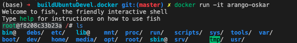
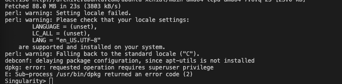

<!-- 
✅ - complete
⏰ - in progress
❌ - struggle / cannot complete
-->

# Winter 2023 Research Log

<!-- TABLE OF CONTENTS -->
<details open="open">
  <summary>Table of Contents</summary>
  <ol>
    <li>
      <a href="#weekly-updates">Weekly Updates</a>
      <ol>
        <li><a href="#week-one">Week One</a></li>
        <li><a href="#week-two">Week Two</a></li>
        <li><a href="#week-three">Week Three</a></li>
      </ol>
    </li>
    <li><a href="#key-findings">Key Findings</a></li>
    <li><a href="#possible-solutions">Possible Solutions</a></li>
    <li><a href="#glossary">Glossary</a></li>
    <li><a href="#overall-questions">Overall Questions</a></li>
  </ol>
</details>

**Key:**
✅ - complete | ⏰ - in progress | ❌ - struggle / cannot complete
<!-- Weekly Updates -->
## Weekly Updates
### Week One

###### *Dates:* January 8-14, 2024

###### *Main Objective:* Begin to understand ArangoDB and OpenCypher codebase

#### Team Tasks:
1. ✅ Reorganize GitHub
2. ✅ Fork [OpenCypher](https://github.com/opencypher/openCypher) and [ArangoDB](https://github.com/arangodb/arangodb).
3. ❌ Setup Dockerfile so ArangoDB and OpenCypher will work on all machines. 
    - Too many setup operations...Dockerfile would be unrealistic and a waste of time.
4. ⏰ Setup ArangoDB and OpenCypher in CSC, create straightforward instructions for rest of team.
5. Beginning looking into documentation for both [OpenCypher](https://s3.amazonaws.com/artifacts.opencypher.org/openCypher9.pdf) and [ArangoDB](https://docs.arangodb.com/3.11/aql/). 
6. ✅ Find CFG implementations in both codebases. 
7. ⏰ Begin to understand how the CFG works in parallel with the rest of the codebase.
8. ✅ Reach out to the teams of both and ask if they have the feature we are looking for. 
8. ✅ Update pushing functionality for both repos.

#### Individual Tasks:
1. ✅ Wyatt - research and understand CFGs

#### Accomplishments:
- January 10th: 
  - rearranged GitHub to be more friendly towards the year's project. Added space for research logs and key findings, glossary, etc.
- January 12th: 
  - forked codebases for both ArangoDB and OpenCypher, [arangodb_esrp](https://github.com/wrcorcoran/arangodb_ersp) and [opencypher](https://github.com/wrcorcoran/openCypher_ersp).
  - updated README.md for both and added collaborators along with proper permissions.
  - located directory for grammars in both codebases.
- January 13th:
  - located ```grammar_tools```, which the Grammar specifications by openCypher. 
  - Tried to run both ArangoDB and OpenCypher's GitHubs and ran into errors for both. See ```Struggles``` for more information.
  - Working on following the ArangoDB specifications for [contributing](https://github.com/arangodb/arangodb/blob/devel/CONTRIBUTING.md#building).
  - Niyati sent messages to both teams to ask if they are working on a similar functionality to what we could "use."Is there a function on both these    platforms to query the graph and the latent space?

#### Specific Questions:
- What is Gherkin? Encountered it while looking into the OpenCypher codebase.
- How are we supposed to use ArangoDB if we have to pay? Also, there seems to be no option to use it strictly in terminal, so do we have to craft that ourself? **(Ignore. Answered by more reading.)**

#### Relevant Papers / Links:
- [ArangoDB Github](https://github.com/arangodb/arangodb)
- [ArangoDB documentation](https://docs.arangodb.com/3.11/aql/)
- [OpenCypher Github](https://github.com/opencypher/openCypher)
- [OpenCypher documentation](https://s3.amazonaws.com/artifacts.opencypher.org/openCypher9.pdf)
- [Context free schemas for data-XML (important for OpenCypher)](https://www.w3.org/People/Bos/Schema/schemas)
- [Indicated as Syntax Tree Template by OpenCypher](https://www.w3.org/2001/XMLSchema)
- [Cypher Railroad Diagram of Grammar](https://s3.amazonaws.com/artifacts.opencypher.org/M23/railroad/Cypher.html)
- [Cypher Specific Style Guide](https://s3.amazonaws.com/artifacts.opencypher.org/M23/docs/style-guide.pdf)
- [ArangoDB Contributing Guide (includes building specifications)](https://github.com/arangodb/arangodb/blob/devel/CONTRIBUTING.md#building)

#### Notes:
- ArangoDB grammar is found in 'arangod/Aql/grammar.cpp' and 'arangodb/Aql/grammar.hpp' and 'Aql/grammar.y'. Have not identifying the exact files (and what they do), but that will be the next step.
- OpenCypher's grammar is found under 'grammar' (wow!). Includes a README.md with specifics about the grammar.

#### Struggles:
- Running into Maven build errors when trying to execute the ```mvn -U clean install -P scala-213 -Dlicense.skip``` command. Unsure if this is because of something I don't have installed correctly or a dependency failure further up.
  - The specific error is ```org.apache.maven.plugins:maven-compiler-plugin:3.8.1:compile (default-compile) on project grammar: Fatal error compiling: invalid target release: 11 -> [Help 1]```. I've ran it in debug mode and get messages that are relatively unreadable. Not sure where to go here.

### Week Two

###### *Dates:* January 15-21, 2024

###### *Main Objective:* Understand CFGs and play around in terminal

#### Team Tasks:
1. ⏰ Setup ArangoDB and OpenCypher in CSC, create straightforward instructions for rest of team.
2. ⏰ Beginning looking into documentation for both [OpenCypher](https://s3.amazonaws.com/artifacts.opencypher.org/openCypher9.pdf) and [ArangoDB](https://docs.arangodb.com/3.11/aql/), understand the language to build off of.  
3. ⏰ Begin to understand how the CFG works in parallel with the rest of the codebase.

#### In Progess:
- Figuring out how to run both ArangoDB and OpenCypher. Building documentation. 

#### Accomplishments:
- January 15th:
  - decided that the requirements to set up a Dockerfile for each would be too much, as they both require a large amount of steps.
  - decided to move to CSIL, with doing this, create documentation to set up and install. 
- January 16th: 
  - got verified for CSC, able to clone both directories. Currently, working on initializing and running both. 
- January 17th:
  - looked into two different sites (listed below) recommended by Danish, regarding FAISS's usage with ArangoDB. Neither of them appear to be what we are doing, rather, they are just functionality to run after querying.
  - got in contact with Arango, they listed out a few ways to implement the functions:
  1. Vector Similarity Functions
  2. Full-Text Search with Semantic Features
  3. Graph Traversal and Algorithms
  4. User-Defined Functions (UDFs): Custom UDFs, External libraries, ArangoML
- Janauary 19th:
  - Beginning to setup ArangoDB and OpenCypher to run in terminal on CSC. 
    - Currently running into problems running FISH (ArangoDB)
    - Cannot use ```yum```, but ArangoDB requires a fish shell to run. 
    - Trying to find workarounds (installing Miniconda, then installing fish)
    - Turns out those don't help too much, instead, have to make a singularity container. This requires me to install VirtualBox on my local, which I have. However, running into hiccups and will resume tomorrow, the 20th. Nvm, can use singularity straight in knot, but still weird. Need to figure it out.
- January 21st:
  - Still struggling to get ArangoDB or OpenCypher to work, really frustrating actually. Difficult to get it working on CSC due to all of the permissions limitations (not allowed to sudo or anything).
  - Working on my local machine (ArangoDB), not sure how to run tests and play around yet
  - Currently, trying to find a way to get this to work on the CSC machine
    - tried all sorts of things (docker images converted to singularity images, docker pull options, etc.)
  - Everytime, run into errors on CSC machines because of sudo'ing or superuser. 
    - Due to lack of permissions, I think this is likely unpossible, leaving us with a Dockerfile.
  - Trying the built-in Dockerfile (local) for ArangoDB's Oskar. 
    - This would allow us to work locally and in the same environment. Seems promising if they can install.
    - Running into problems with fish and locating files. Testing that out. 
  - However, ArangoDB is making progress locally... runs openSSL command for about 10 minutes upon installation... will report what happens after. 
    - openSSL was fine - then get incompatible compiler errors
  - If do not get successful build tonight, will drop ArangoDB and focus solely on getting openCypher to work.
    - Most recent Docker build - 30 minutes. Will focus strictly on openCypher after this.
    - This is how terminal appears:
      

  - OpenCypher error (installing any package on a ubuntu singularity shell in CSC):
  


#### Specific Questions:
- 

#### Relevant Papers / Links:
- [ArangoDB documentation](https://docs.arangodb.com/3.11/aql/)
- [OpenCypher documentation](https://s3.amazonaws.com/artifacts.opencypher.org/openCypher9.pdf)
- [Context free schemas for data-XML (important for OpenCypher)](https://www.w3.org/People/Bos/Schema/schemas)
- [Indicated as Syntax Tree Template by OpenCypher](https://www.w3.org/2001/XMLSchema)
- [Cypher Railroad Diagram of Grammar](https://s3.amazonaws.com/artifacts.opencypher.org/M23/railroad/Cypher.html)
- [Cypher Specific Style Guide](https://s3.amazonaws.com/artifacts.opencypher.org/M23/docs/style-guide.pdf)
- [ArangoDB Contributing Guide (includes building specifications)](https://github.com/arangodb/arangodb/blob/devel/CONTRIBUTING.md#building)
- [ArangoDB Interactive Tutorials](https://github.com/arangodb/interactive_tutorials/blob/master/README.md)
- [fastgraphml](https://github.com/arangoml/fastgraphml/tree/main)

#### Notes:
- ArangoDB Interactive Tutorials - FAISS implementation is fragmented and unfinished. However, It appeared that they were using FAISS on top. Not as a querying capability. This is not what we are looking for. 
- fastgraphml - This basically just involves the power of FAISS into fastgraphml. There is no difference between using FAISS's function and fastgraphml's. fastgraphml purely implements FAISS's functionality, which no added usage. However, it does add the capability to *store* embeddings back into FAISS. The implementation is to include the nearest neighbors and their respective cosine similarity as a list in the database. This could be helpful with ideas for how to store it - but not as a querying functionality.

- Zero progress being made on installing ArangoDB. Thinking it's probably wise to give that up. Moving to focus strictly on OpenCypher. If that doesn't work, will have to move to a smaller repository to build on top of. 

### Week Three

###### *Dates:* January 22-28, 2024

###### *Main Objective:* Understand CFGs and play around in terminal

#### Team Tasks:
1. ✅ Setup ArangoDB and OpenCypher in CSC (possibly just OpenCypher), create straightforward instructions for rest of team.
2. ⏰ Beginning looking into documentation for [OpenCypher](https://s3.amazonaws.com/artifacts.opencypher.org/openCypher9.pdf) understand the language to build off of.  
3. ⏰ Begin to understand how the CFG works in parallel with the rest of the codebase.
4. ⏰ Develop a test suite for OpenCypher. 

#### In Progess:
- Figuring out how to develop a test suite (and optimize for usability) for OpenCypher.

#### Accomplishments:
- January 22:
  - Got ArangoDB to build Dockerfile (however, couldn't recognize ssh-agent and Docker)
  - Have decided to pause any work with ArangoDB. OpenCypher is more straightforward to operate. 
  - Currently, going to focus on OpenCypher.
    - Making great progress - farthest ever gotten on a build.
    - Had to reset JAVA_HOME variable, tough with Dockerfile, eventually got it.
    - Running deeper into test set for ```mvn``` project.
    - BUILD SUCCESS! Bingo!
  - Noted, TCK is their test suite. They used Cucumber files (.feature) to assist with tests.
  - Have set up Ubuntu-based Dockerfile for OpenCypher.
  - Updated documentation for OpenCypher usage.

#### Specific Questions:
- 

#### Relevant Papers / Links:
- [OpenCypher documentation](https://s3.amazonaws.com/artifacts.opencypher.org/openCypher9.pdf)
- [Context free schemas for data-XML (important for OpenCypher)](https://www.w3.org/People/Bos/Schema/schemas)
- [Indicated as Syntax Tree Template by OpenCypher](https://www.w3.org/2001/XMLSchema)
- [Cypher Railroad Diagram of Grammar](https://s3.amazonaws.com/artifacts.opencypher.org/M23/railroad/Cypher.html)
- [Cypher Specific Style Guide](https://s3.amazonaws.com/artifacts.opencypher.org/M23/docs/style-guide.pdf)

#### Notes:
- We have decided to hault all work on ArangoDB.

#### Struggles:
- 

<!-- Key Findings -->
## Key Findings
Currently, none.

<!-- Possible Solutions -->
## Possible Solutions
Currently, none.

<!-- Glossary -->
## Glossary
Currently, none.

<!-- Questions -->
## Overall Questions
Currently, none.
