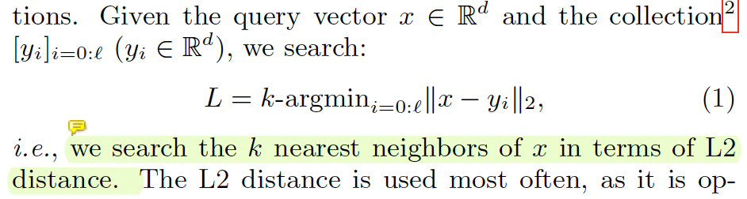
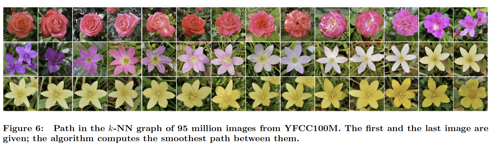

# Papers

### Key Questions:
1. What literature already exists?
2. How close are they to what we want to do?
3. What are they missing?
4. Do they have public code?
<br></br>
----

### Relevant Papers:

#### [Visualizing Graph Neural Networks With CorGIE: Corresponding a Graph to Its Embedding (CorGIE)](https://ieeexplore.ieee.org/stamp/stamp.jsp?tp=&arnumber=9705082)
- [Code](https://github.com/zipengliu/corgie-ui/)
- [Tutorial](https://osf.io/j56hu)
- This is by far the most similar paper to our project, and in all honestly, I don't know if I see an apparent difference between the two. I'd like a review from Danish to see the similarities and what exactly differs from our outcome goal.
- I'm honestly not sure what they are missing. 
- > We propose
an approach to corresponding an input graph to its node embedding (aka latent space), a common component of GNNs that is later
used for prediction. We abstract the data and tasks, and develop an interactive multi-view interface called CorGIE to instantiate the
abstraction.

#### [Querying in the Age of Graph Databases and Knowledge Graphs, *Will*](https://dl.acm.org/doi/abs/10.1145/3448016.3457545)
For the most part, this paper is a survey of the past 10 years of graph querying. 

They begin by defining "knowledge graphs," which they state are: "a
software object (artifact) that represents (codifies), integrates and
produces knowledge."

They claim the biggest benefit of knowledge graph are the added capabilities to learn new things. They mention this is through neural networks or other logical reasoners (they outline a RegEx formula for this). However, compared to previous graph representations, this is a new capability.

They expand on the benefits of vector-labeled graphs and their impact in GNNs. They state that
> "vector-labeled graphs are defined in a way that
unifies the use of labels and properties, and allows to include in
a simple way extra values that are necessary for message-passing
graph algorithms [49], such as the Weisfeiler-Lehman graph isomorphism
test [39, 41, 83], and when graphs are used as input of
graph neural networks [58, 72]."

For the most part, I feel like I understand what this means, but I don't necessarily under the WL test. I understand it's similar to node colouring, but I don't understand how this can be used algorithmically for message passing. They also state $FOC^2$ is equivalent to the WL test. I understand that $FO^2$ is first-order logic with two unknowns, but how can we define $FOC^2$. They give an intense mathematically definition that has to do with quantifier dimensionality.

Then, they formally defined a GNN. I'll leave the notation in the paper. However, they claim that a GNN process follows three functions, $AGG$ and $COMB$ for each layer, along with $CSL$ at the end.

#### [Expressive Power of Graph Neural Networks as a Query Language, *Wyatt*](https://dl.acm.org/doi/pdf/10.1145/3442322.3442324)
- > In the context of databases, one can see a graph as a graph database [27, 5],and a classifier f as a query language: On input graph (database) G, the query would return all the nodes in G that are classified as true by f. Thus, answering the question above implies understanding what type of queries can be expressed by GNNs.
- [GitHub of Code](https://github.com/juanpablos/GNN-logic)
- Based on how I've understood this, they are more focused on the binary classification of a node in a graph (either true or false), rather than the querying of a node both in the database and on the GNN.

#### [A Query Language Perspective on Graph Learning, *Niyati*](https://dl.acm.org/doi/pdf/10.1145/3584372.3589936)
- Here is a paper which outlines ```GEL```, a Graph Embedding Language. Rather than a coding language, it's expressed mathematically.
- > More precisely, we define a general graph embedding language, referred to as gel in which graph neural networks (and other graph learning methods) can be expressed. The language is very similar to the aggregate query languages considered for studying the expressive power of SQL [51, 71].
- As it is mathematically developed, there is no formal code.

----
#### [Local Intrinsic Dimensionality Measures for Graphs, with Applications to Graph Embeddings, *Niyati*](https://arxiv.org/pdf/2208.11986.pdf)

#### [Query Driven-Graph Neural Networks for Community Search: From Non-Attributed, Attributed, to Interactive Attributed, *Wyatt*](https://arxiv.org/pdf/2104.03583.pdf)
- This model seems to take a query of a database, and transform it into its own, respective GNN. It's possible we can get ideas from this paper, but the solution (or similar solutions), are not present.
- No publicly available code.

#### [Billion-scale similarity search with GPUs (FAISS), *Will*](https://arxiv.org/pdf/1702.08734.pdf)

This is the paper in tandem with the creation of FAISS. It takes more of a focus to the impressive feats accomplished by the team in terms of calculation time. Most of this has to do with the usage of GPUs to run the software. They claim they can perform k-NN searches with 55% of the optimal, theoretical solutions, which is 8.5x better than the previous state-of-the-art. 

> This paper makes the following contributions:
> - a GPU k-selection algorithm, operating in fast register
memory and 
exible enough to be fusable with other
kernels, for which we provide a complexity analysis;
> - a near-optimal algorithmic layout for exact and ap-
proximate k-nearest neighbor search on GPU;
> - a range of experiments that show that these improve-
ments outperform previous art by a large margin on
mid- to large-scale nearest-neighbor search tasks, in
single or multi-GPU congurations.


So, for the most part the paper doesn't concern our project, as we are not focused on GPU optimization with the searches. However, they do outline the k-NN algorithm used by FAISS and give a couple wonderful examples.

Here is the k-NN algorithm:


Here is an example of the kinds of k-NN searches FAISS can perform:


----
### Less Relevant Papers:
#### [Comparing and Exploring High-Dimensional Data with Dimensionality Reduction Algorithms and Matrix Visualizations](https://dl.acm.org/doi/pdf/10.1145/3399715.3399875)
- This focuses more on the visualization between high-dimensional data, and low dimensional-data. It's moreso used on matrices rather than Graphs / GNNs, but it could be a useful idea. 
- > a tool for visual analysis for comparing distances of high-dimensional (HD) data and their low-dimensional projections.

#### [Graphs-at-a-time: Query Language and Access Methods for Graph Databases](https://dl.acm.org/doi/pdf/10.1145/1376616.1376660)
- Funny enough, this was written by Professor Singh!
- As I'm not responsible for researching the frameworks, I'm not sure if this is how modern-day Graph DBs are implemented. It's likely, but I'm not sure.
- > We propose a query language for graph databases that
supports arbitrary attributes on nodes, edges, and graphs.
In this language, graphs are the basic unit of information and
each query manipulates one or more collections of graphs.
To allow for flexible compositions of graph structures, we
extend the notion of formal languages from strings to the
graph domain. We present a graph algebra extended from
the relational algebra in which the selection operator is generalized to graph pattern matching and a composition operator is introduced for rewriting matched graphs.